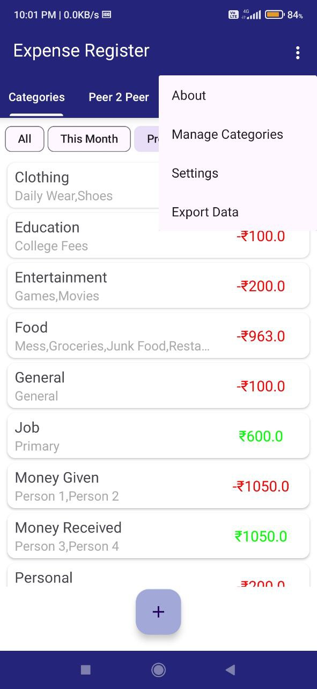

# Expense Register

An android Application for tracking and managing personal finance
## App Screenshots

  
  
  

  
  
  

## Features

- **Personal Finance Management**: Easily manage your personal finances, track income, and monitor expenses.
- **Expense Categorization**: Categorize your expenses to gain insights into your spending habits.
- **Custom Categories and Subcategories**: Create custom categories and subcategories to organize your transactions according to your needs.
- **Data Export**: Export your financial data as TXT or CSV files for further analysis or backup purposes.
- **Transaction Reminders**: Set reminders for pending transactions to ensure timely payments and avoid missed deadlines.
- **Scheduled SMS Reminders**: Schedule SMS reminders to notify recipients about pending payments or to remind them to return borrowed money.

## Installation

Download my-project from Github

## Future Features

Here are some features I plan to add in future releases:

- **Budgeting Options**: Introduce options to set budgets for different expense categories to help users better manage their finances.
- **Graphical Trends**: Implement graphs and charts to visualize spending trends over time, providing users with insights into their financial habits.
- **Customizable Dashboard**: Allow users to customize their dashboard according to their preferences, making it more personalized and user-friendly.
- **UI/UX Enhancements**: Improve the user interface and experience by enhancing design elements and incorporating smooth animations.

If you have any suggestions for additional features, please feel free to open an issue or submit a pull request!

## Contributing

Contributions are always welcome!

If you'd like to contribute to this project, please follow these guidelines:

- Fork the repository
- Create a new branch for your feature or bug fix
- Make your changes and commit them with descriptive messages
- Push your changes to your fork
- Submit a pull request

Thank you for contributing to this project!
